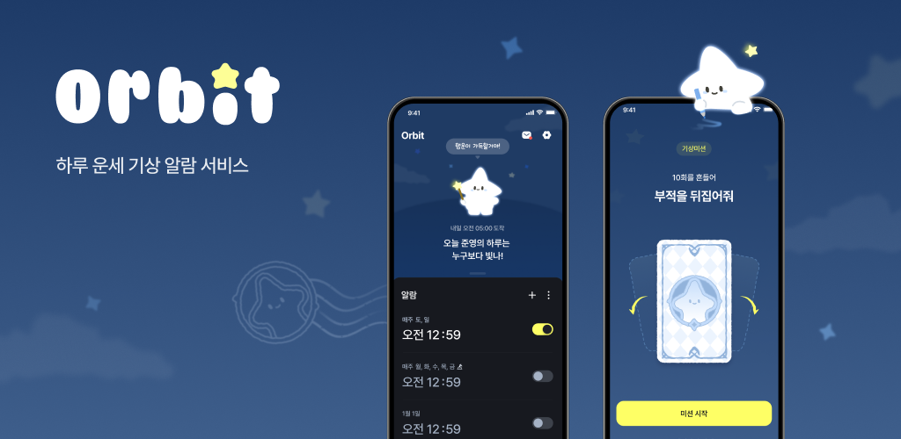
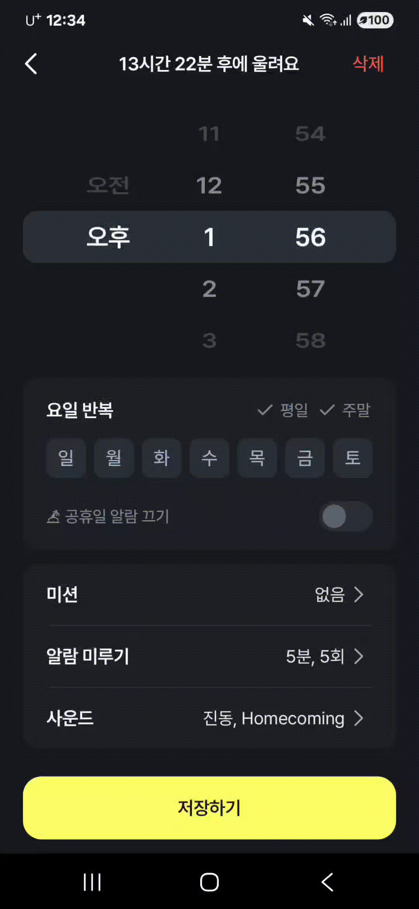
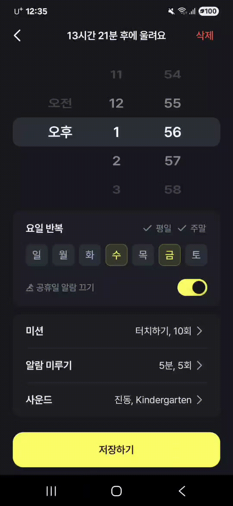
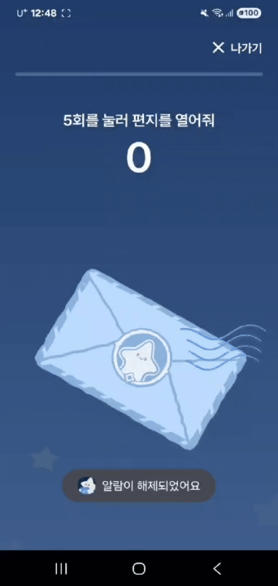
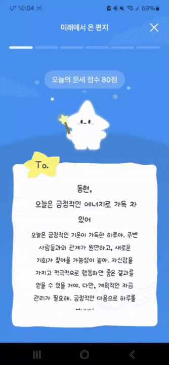
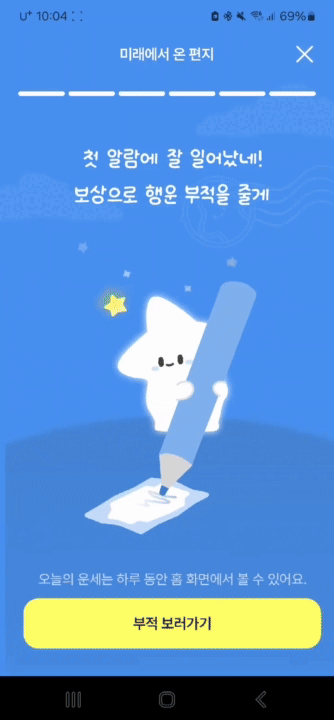
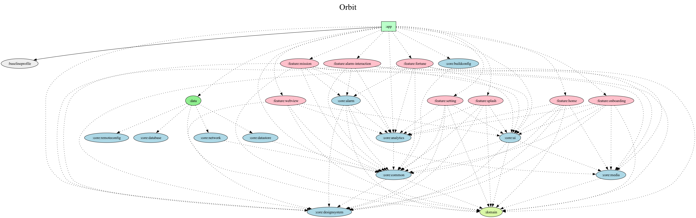

# 아침을 깨우는 새로운 알람!

## 핵심 기능

### 홈 화면

| 알람 단일 삭제 | 알람 복수 삭제 | 알람 정렬 변경 |
|----------|--------|----------|
| |  |          |

### 알람 설정/수정

| 알람 시간 설정 | 알람 반복요일 설정 | 알람 미션 설정 | 알람 미루기 설정 | 알람 사운드 설정 |
| --- | --- | --- | --- | --- |
|  |  |  |  |  |

### 알람 끄기 - 미션

| 알람 해제                                                                                              | 터치 미션                                                                                              | 흔들기 미션                                                                    |
|----------------------------------------------------------------------------------------------------|----------------------------------------------------------------------------------------------------|---------------------------------------------------------------------------|
|  |  |  |

### 운세

| 운세 제공 | 부적 제공                                                                      |
|--------|----------------------------------------------------------------------------|
|  |  |

## 👨‍👦‍👦 팀원

|  |  |
|:--------------------------------------------------------------------------------------:|:--------------------------------------------------------------------------------------:|
|             Donghyeon Kim [@DongChyeon](https://github.com/DongChyeon)             |              Moonsu Kang [@MoonsuKang](https://github.com/MoonsuKang)              |

## 기술 스택

| 카테고리 | 스택                          |
| --- |-----------------------------|
| Language | Kotlin                      |
| Architecture | Orbit-MVI                   |
| DI | Hilt                        |
| Networking | Retrofit, OkHttp, GSON      |
| Asynchronous | Coroutine, Flow             |
| JetPack | AAC, ViewModel, Navigation  |
| Local DB | DataStore, Room             |
| Image | Coil                        |
| Test | JUnit4, MockK, kotlinx-coroutines-test |

## 모듈 의존성 그래프

`app`이 feature/data/core 모듈을 조립하고, feature는 `domain`+필요한 `core`에만 의존하는 계층 구조를 시각화한 그래프입니다. 
각 모듈의 역할과 의존 규칙은 [docs/Modularization.md](docs/Modularization.md)에 정리되어 있습니다.

## 아키텍처 설계

주요 화면은 Orbit-MVI + Compose를 사용해 `Contract.State`로 상태를 단일화하고, Intent/Reducer 패턴으로 흐름을 제어합니다. 
Hilt가 ViewModel/Repository를 주입하고, `core:*` 모듈이 네트워크·알람·미디어 같은 인프라를 제공합니다. 
그 외의 정보는 [docs/Architecture.md](docs/Architecture.md)에서 더 자세히 다룹니다.
