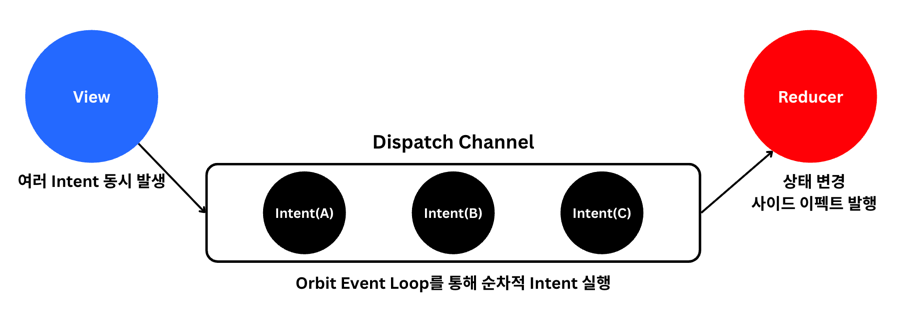

## 클린 아키텍처 적용 방식


### 계층 책임 정리

| Layer | 대표 모듈 | 핵심 책임                                                                | 상위 계층 노출 방식 |
| --- | --- |----------------------------------------------------------------------| --- |
| Domain | `domain` | 비즈니스 모델, Repository 인터페이스, Scheduler 계약                              | Kotlin interface + data class (의존성 역전) |
| Data | `data` | `FortuneRepositoryImpl`, `AlarmRepositoryImpl` 등 외부 소스 연동 | Domain 인터페이스 구현체를 Hilt로 바인딩 |
| UI/Feature | `feature:*`, `app` | Compose 화면, Orbit Container 기반 ViewModel, 내비게이션                      | Domain 인터페이스 주입, core 유틸 사용 |
| Core | `core:*` | 네트워크, 디자인 시스템, 알람, 미디어 등 인프라성 로직                                     | 필요한 모듈에 `implementation`으로 의존 |

### 인터페이스 우선 접근
도메인 계약(`domain/src/main/java/com/yapp/domain/repository/FortuneRepository.kt`)은 어떠한 프레임워크에도 의존하지 않습니다.

```kotlin
interface FortuneRepository {
    val fortuneCreateStatusFlow: Flow<FortuneCreateStatus>
    suspend fun getFortune(fortuneId: Long): Result<Fortune>
    suspend fun markFortuneSeen()
    // ...
}
```

UI 계층에서는 구현체가 아닌 인터페이스만 주입합니다. 예시는 `feature/mission/src/main/java/com/yapp/mission/MissionViewModel.kt`입니다.

```kotlin
@HiltViewModel
class MissionViewModel @Inject constructor(
    private val fortuneRepository: FortuneRepository,
    // 생략
) : ViewModel(), ContainerHost<MissionContract.State, MissionContract.SideEffect> {
    private fun completeMission(type: String) = intent {
        val status = fortuneRepository.fortuneCreateStatusFlow.first()
        // 상태 계산 & 사이드이펙트 전파
    }
}
```

`FortuneRepositoryImpl`(data 모듈)은 Retrofit/Room/Datastore를 조합해 인터페이스를 만족시키고, `app` 모듈의 Hilt module에서 바인딩합니다. 이 흐름 덕분에 API 스펙이 바뀌어도 UI 모듈은 인터페이스 그대로 유지되며, 테스트에서는 Fake/Stub Repository만 주입하면 됩니다.

## MVVM vs. MVI, 그리고 MVI를 사용한 이유

안드로이드에서 흔히 MVVM과 MVI의 차이를 양방향 vs. 단방향, 여러 상태 vs. 단일 상태로 설명하지만 실제로는 이 구분이 정확하지 않습니다.<br>
공식 문서의 아키텍처 다이어그램을 보면 MVVM 역시 사용자 이벤트 → ViewModel → Data Layer → State → View 의 단방향(UDF) 흐름을 유지합니다.<br>
또한 단일 상태 객체를 사용하는 것도 MVI만의 특징이 아니라 MVVM에서도 충분히 적용 가능합니다.

제가 생각하는 두 패턴의 본질적인 차이는 **“상태 변경을 어떻게 발생시키는가”**, 즉 **View와 ViewModel의 결합도**입니다.

- **MVVM**: View가 ViewModel의 메서드를 직접 호출합니다. 이로 인해 View는 ViewModel의 API에 의존하고, 상태 변경 로직이 여러 메서드에 흩어질 수 있습니다. 상태가 여러 소스에 분산되면 테스트 시 개별 흐름을 따로 검증해야 하고 UI가 일시적으로 불완전한 스냅샷을 보여줄 가능성도 있습니다.
- **MVI**: View는 Intent(사용자의 의도)만 발행하고, 상태 변경은 ViewModel 내부의 Reducer에서 단일 경로로 처리됩니다. 모든 상태 변화 흐름이 표준화되고 순차적이기 때문에 UI 일관성과 테스트 용이성이 높아집니다.

Orbit-MVI는 이러한 MVI 철학을 유지하면서도 ViewModel 기반 개발의 생산성을 유지하기 때문에 오르비 프로젝트에서 채택했습니다.

## MVVM(UDF) vs. Orbit-MVI 비교

| 항목 | MVVM(UDF) 해석 | Orbit-MVI 적용 |
| --- | --- | --- |
| 데이터 흐름 | View → ViewModel 메서드 → Flow/State → View. Compose의 `collectAsState()`로 단방향 데이터 흐름 유지 가능. | View → `processAction()` → Intent → Reducer → State/SideEffect. Orbit DSL이 순차 처리와 스레드 안전성을 보장. |
| 상태 관리 | 여러 `StateFlow`/`mutableStateOf`를 별도로 관리하면 상태 조각이 흩어질 수 있음. | 화면 상태를 단일 `Contract.State` 객체로 표현 (`MissionContract.State`, `FortuneContract.State` 등). |
| 의존 관계 | View가 ViewModel의 public 메서드를 직접 호출 → 결합도 증가. | View는 Intent(Action)만 전달. 상태 변경 로직은 Reducer 내부로 캡슐화되어 결합도 감소. |
| 테스트 | 여러 Flow·상태 소스를 각각 검증해야 함. | Intent 호출 → 단일 State snapshot만 검증. Orbit `test` 모듈로 시나리오 기반 테스트 용이. |
| 적용 모듈 | `core/ui` 내부 공용 UI, Compose Preview 등에서 자연스럽게 MVVM 기반. | `feature/mission`, `feature/fortune`, `feature/home`, `feature/onboarding` 등에서 Orbit-MVI 적용. |

## Orbit-MVI를 선택한 이유와 실제 장점

이전에 `논프레임워크 MVI`를 구현했던 경험이 있어 상용 MVI 라이브러리와 비교하며 장점을 느낄 수 있었습니다.

### 1) Mavericks 대비 실질적 장점

- `SavedStateHandle`을 직접 주입할 수 없음 → 상태 복원 시 `@PersistState` 의존
- ViewModel 생성 시 AssistedInject + ViewModelModule 필요 → 보일러플레이트 증가

### 2) Orbit-MVI 채택 이유

- **DSL 기반 선언적 상태 관리**
    - `intent {}`, `reduce {}`, `postSideEffect {}` 형태로 구조가 명확
    - 상태 변경 경로가 자연스럽게 단일화 → 가독성 우수

- **생명주기 안전 플로우 처리**
    - `repeatOnSubscription`으로 화면 구독 시점에만 Flow 수집
    - 생명주기 직접 제어 불필요

- **내부 DispatchQueue 기반 순차 처리**
    - 모든 Intent가 큐에 쌓여 차례대로 실행
    - 경쟁 상태나 중간 스냅샷 문제를 라이브러리 수준에서 해결
    - 개발자는 비즈니스 로직에 집중 가능


