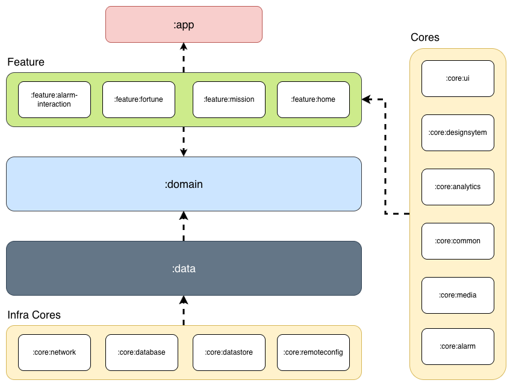
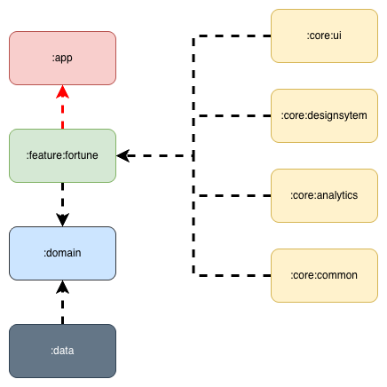
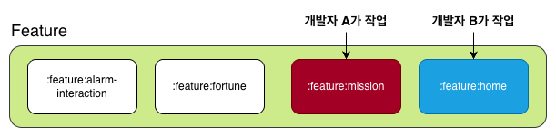

## 모듈화 전략



- `app`은 전역 내비게이션 그래프와 Hilt 엔트리포인트를 정의하고, 나머지 모듈을 wiring 합니다.
- `feature:*` 모듈은 화면/플로우 단위(예: `feature:mission`, `feature:fortune`)로 분리되어 UI, ViewModel, 네비게이션 라우트를 자체 포함합니다.
- `core:*` 모듈은 디자인 시스템, 네트워크, 알람, 분석 등 공통 인프라를 제공합니다.
- `domain`은 순수 Kotlin 모듈로 비즈니스 모델과 Repository/Scheduler 계약을 정의합니다.
- `data`는 네트워크/로컬 소스를 조합하고 Domain 계약을 구현합니다.

## 모듈 유형과 책임

| 유형    | 대표 모듈                                                                                                                                              | 책임                                                                                                   |
|---------|---------------------------------------------------------------------------------------------------------------------------------------------------------|--------------------------------------------------------------------------------------------------------|
| Entry   | `app`                                                                                                                                                   | Compose Navigation, Hilt component 그래프, deeplink 처리, build variant 설정                           |
| Feature | `feature:fortune`, `feature:mission`, `feature:onboarding`, `feature:home`, `feature:setting`, `feature:splash`, `feature:webview`, `feature:alarm-interaction` | 개별 화면/기능 단위 모듈                                                                              |
| Domain  | `domain`                                                                                                                                                | 모델(`Fortune`, `Alarm`, …), Repository/Scheduler 인터페이스, 순수 로직                                |
| Data    | `data`                                                                                                                                                  | Retrofit/Room/Datastore 등 외부 연동, 캐시 정책, Repository 구현체. OS 의존 알람 스케줄링은 `core:alarm`에 위임 |
| Core    | `core:designsystem`, `core:network`, `core:analytics`, `core:alarm`, `core:datastore`, `core:remoteconfig`, `core:media`, `core:ui`, `core:common`, `core:database`, `core:buildconfig` | 재사용 UI 컴포넌트, 네트워크/DB 클라이언트, 알람 스케줄러, Analytics wrapper 등 cross-cutting concern |

## 의존성 규칙

```
app
├── data
├── core/*
└── feature/*
    ├── domain
    └── core/*

data
├── domain
└── core/*

core 모듈 간에는 필요한 최소한의 방향(예: designsystem ← ui)만 허용하고, feature ↔ feature 간 의존은 금지합니다.
```

- `feature/*` 모듈은 `:app`에만 등록되며, 공통 라우팅은 각 feature가 제공하는 `Destination`를 app 모듈이 조립하는 방식으로 관리합니다.

## 빌드 시간 최적화

1. **증분 빌드**: 모듈 간 경계가 뚜렷해 `./gradlew :feature:fortune:assembleDebug`처럼 부분 빌드가 가능합니다. 변경된 모듈과 그 상위 모듈만 재빌드되며, 나머지는 Gradle Build Cache 산출물을 재사용합니다.<br>
   <br>
   위와 같이 `feature:fortune`만 수정한 경우, `data`, `domain`, `core` 모듈은 변경되지 않고, 연관된 `app`과 `feature:fortune`만 재빌드됩니다.
2. **Configuration Cache & Version Catalog**: `gradle.properties`에 `org.gradle.configuration-cache=true`를 고정으로 선언해 모든 개발자/CI 빌드가 동일하게 캐시를 사용합니다.<br>`settings.gradle.kts`에서 `includeBuild("build-logic")`로 끌어오는 convention plugin이 Hilt/Compose/테스트 구성을 한곳에서 처리합니다.<br>공통 의존성은 `gradle/libs.versions.toml`에 모아 설정 단계 중복 조회를 줄였습니다.

## 협업 이점

1. **작업 범위 명확화**: 미션 화면 담당자는 `feature:mission`, 알람 설정 담당자는 `feature:home`에만 접근합니다. feature 간 의존을 허용하지 않기 때문에 Git 충돌 가능성도 낮습니다.
   
2. **PR 흐름 단순화**: Domain/Data/Core에서 계약(인터페이스, DTO)을 먼저 확정하고 Feature 모듈이 이를 소비하는 순서로 PR을 나눕니다. 이 순서 덕분에 리뷰어는 스펙과 화면 구현을 분리해 검토할 수 있습니다.
